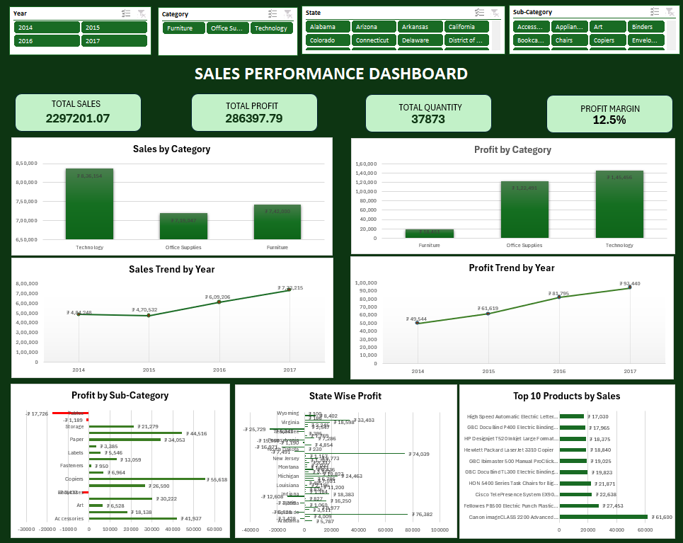

# Sales Performance & Business Analytics Dashboard | Excel

## Project Overview

An interactive sales analytics dashboard developed using Microsoft Excel to analyze sales performance, profitability, product performance, customer performance, and regional trends.

The project involved data cleaning, transformation, exploratory analysis, PivotTables, PivotCharts, dynamic KPIs, and interactive slicers.

##  Tools & Skills

- Microsoft Excel
- Data Cleaning
- Excel Formulas
- PivotTables
- PivotCharts
- Slicers
- Data Analysis
- Business Insights

## Dashboard Features

- Total Sales
- Total Profit
- Total Quantity
- Profit Margin
- Sales by Category
- Profit by Category
- Yearly Sales Trend
- Yearly Profit Trend
- Profit by Sub-Category
- State-wise Profit
- Top Products by Sales
- Interactive filters using Year, Category, State and Sub-Category slicers

##  Key Insights

- Technology generated the highest sales and profit.
- Furniture showed a sales-profitability mismatch, with Tables and Bookcases contributing losses.
- Overall profit increased consistently from 2014 to 2017.
- Texas recorded the lowest overall profit despite significant sales.
- Several Table products were loss-making, highlighting an area for profitability improvement.

##  Dataset

The dataset contains 9,994 sales records with information including:

- Order Date
- Customer Name
- State
- Category
- Sub-Category
- Product Name
- Sales
- Quantity
- Profit

##  Objective

The objective of this project was to transform raw sales data into an interactive business dashboard and derive actionable insights that can support sales and profitability analysis.

##  Created By

Priyadharshini  
B.E. Electronics & Communication Engineering | 2026 Graduate

##  Key Takeaway

This project demonstrates how Excel can be used to transform raw sales data into meaningful business insights through data cleaning, analysis, visualization, and interactive reporting.
